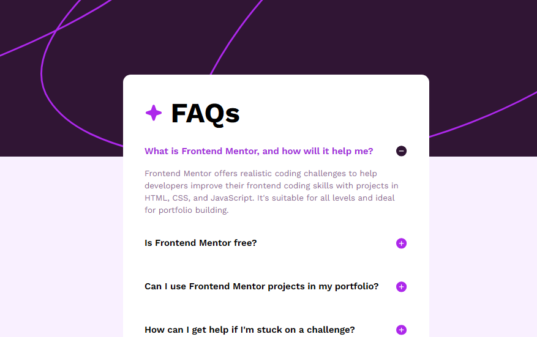

# Frontend Mentor - FAQ accordion

This is a solution to the [FAQ accordion challenge on Frontend Mentor](https://www.frontendmentor.io/challenges/faq-accordion-wyfFdeBwBz). Frontend Mentor challenges help you improve your coding skills by building realistic projects. 

## Table of contents

- [Overview](#overview)
  - [Screenshot](#screenshot)
- [My process](#my-process)
  - [Built with](#built-with)
  - [What I learned](#what-i-learned)
  - [Continued development](#continued-development)
  - [Useful resources](#useful-resources)
- [Author](#author)

## Overview

### Screenshot

### Links

- Solution URL: [GitHub Repository](https://github.com/Flarien/5-faq-accordion)
- Live Site URL: [GitHub Pages](https://flarien.github.io/5-faq-accordion/)

## My process

### Built with

- Semantic HTML5
- CSS custom properties
- Flexbox
- Media Query

### What I Learned
I started this project to revisit and solidify my foundation in web development. Through this challenge, I revisited essential skills, including structuring HTML, styling with CSS, and effectively managing classes. I also focused on enhancing responsiveness by implementing media queries, ensuring the design adapts smoothly across various screen sizes.

Additionally, I learned about the general sibling combinator ~, which allowed me to control styles for elements that appear later in the HTML structure without needing additional JavaScript. This technique was particularly useful in creating the accordion effect.

### Continued Development
I plan to keep practicing consistently, gradually moving on to more complex projects to expand my skills. My goal is to challenge myself with progressively advanced tasks, refining my abilities and documenting my progress here as I go.

### Useful Resources
To assist with layout and measurements, I used the free version of Figma as a reference tool, relying on the JPG image provided by Frontend Mentor as a guide for accurate spacing and design details. Additionally, I incorporated CSS variables to manage predefined colors, enhancing consistency and making future adjustments easier.

## Author

- Website - [FlarienDev](https://flariendev.com.ar)
- Frontend Mentor - [@Flarien](https://www.frontendmentor.io/profile/Flarien)
- LinkedIn - [@flavia-s-briglia](https://www.linkedin.com/in/flavia-s-briglia/)
